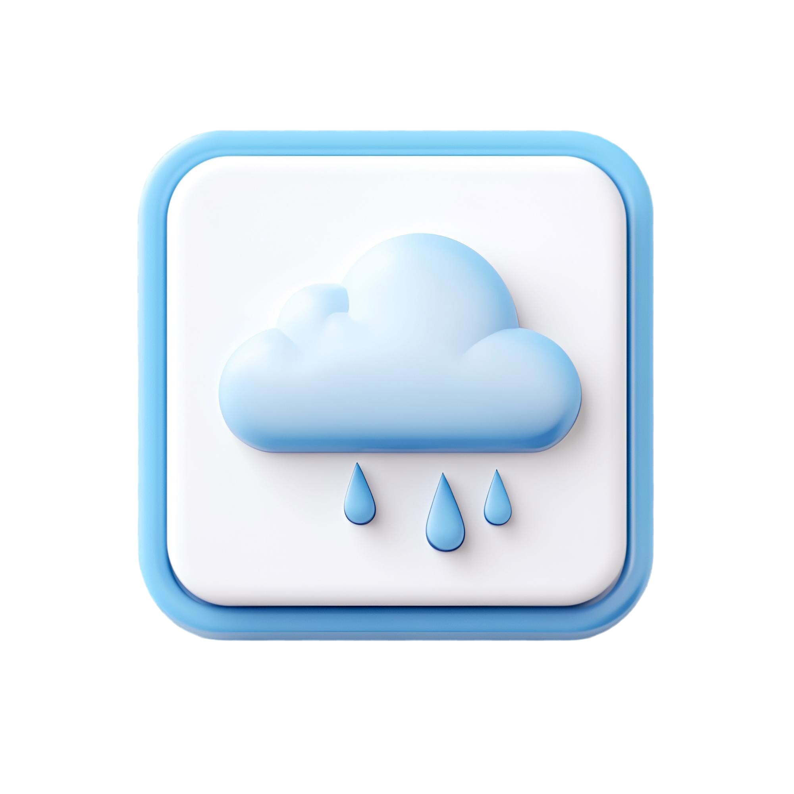

# 🌤️ SkyCast - Weather App  

SkyCast is a modern and minimalistic weather web app that provides real-time weather updates for any location. Built with JavaScript, HTML, CSS, and Webpack, it integrates the **Visual Crossing Weather API** for accurate forecasts.  

## 🚀 Features  
- 🌎 Search weather by city name  
- 🌗 Light & Dark Mode (In Development) 
- 📊 Displays temperature, conditions, humidity, and wind speed  
- 🎨 Modern UI with animated SVG waves  
- ⚡ Built with Webpack for modularity  

## 🛠️ Technologies Used  
- JavaScript (ES6)  
- HTML & CSS  
- Webpack  
- Visual Crossing Weather API  

## 📸 Preview  
  

## 🌍 Live Demo  
🔗 [View SkyCast](https://AhmedMand0ur.io/weather-app/)  

## 🔧 Installation  
Clone the repository and install dependencies:  

```bash
git clone https://github.com/AhmedMand0ur/weather-app.git  
cd weather-app  
npm install  
npm start  
